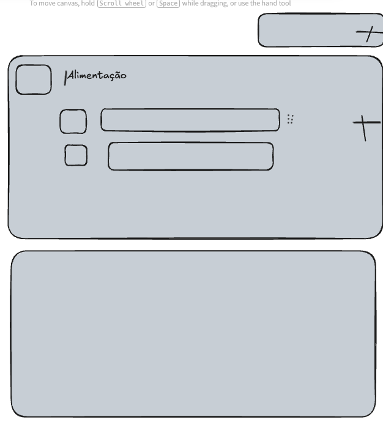
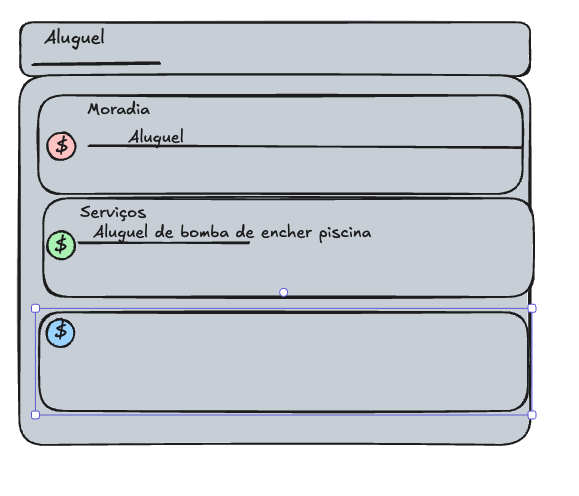

- processo de criação de tipos e classes demorando
  - melhorar feedback de interface
  - explorar melhores formas
- o botão de add (+) hoje está em todas as telas, porém o clique dele estão direcionando sempre pra criação de uma transação. imagino que, dependendo da área em que ele está (Finanças, Entretenimento, Vida) o adicionar possuir uma etapa antes, em Finanças, por exemplo ele pode adicionar uma Receita, uma Despesa, uma nova parcela criada no de Entretenimento, ele pode add um Filme, um Curta, uma Música, um Artigo uma Música
- A importação da lista em csv é muito 'developer turned', deve ser removido a fim de atingir um usuário mais geral
- feedback visual do trial expirado
- central de comandos melhorar, e evoluir iodentificação de ação
- adicionar escolha de gênero para surpreenda-me (filmes)
- melhorar visualização de dimensões, e trocar nomenclatura
  - 
- Revisão das Copies da Landing Page
  - Privacidade, Termos
- Conectar api de lugares para Vida->Lugares
- Mudar linguagem das Parcelas para 'Recorrências' a fim de englobar as parcelas abertas de finanças, mas também custos recorrentes que já são previstos (água, luz)
- Adicionar flag (pago em) nas recorrências
- melhorar linguagme das dimensões
  - em criar transação ou parcela
  - ele ao invés de selecionar a Natureza, e o Tipo, ele digitar em busca da classe
    - no dropdown, já aparecer o tipo e natureza daquela classe
  - melhorar seleção da classe 
    - 
- melhorar roteiros em viagens
  - gerenciar tempos, voos, hospedagens, transportes, atividades (já colocar link, marcar se tá reservado ou não)
  - melhorar carregamento inicial
- link com qr code para convidar amigos, se o convidado criar o cliente